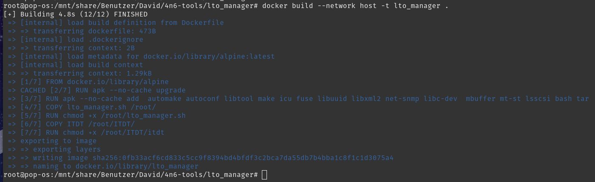
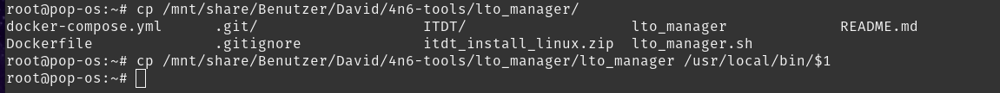
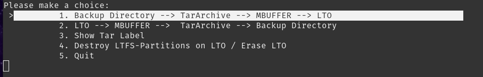
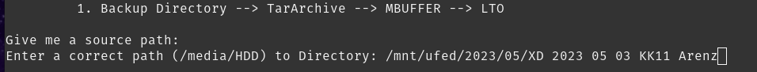
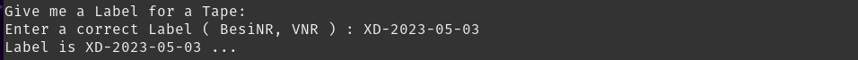
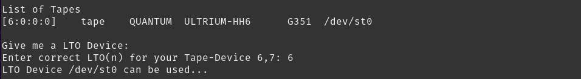
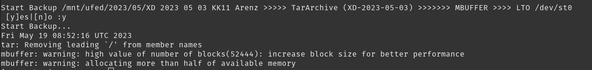
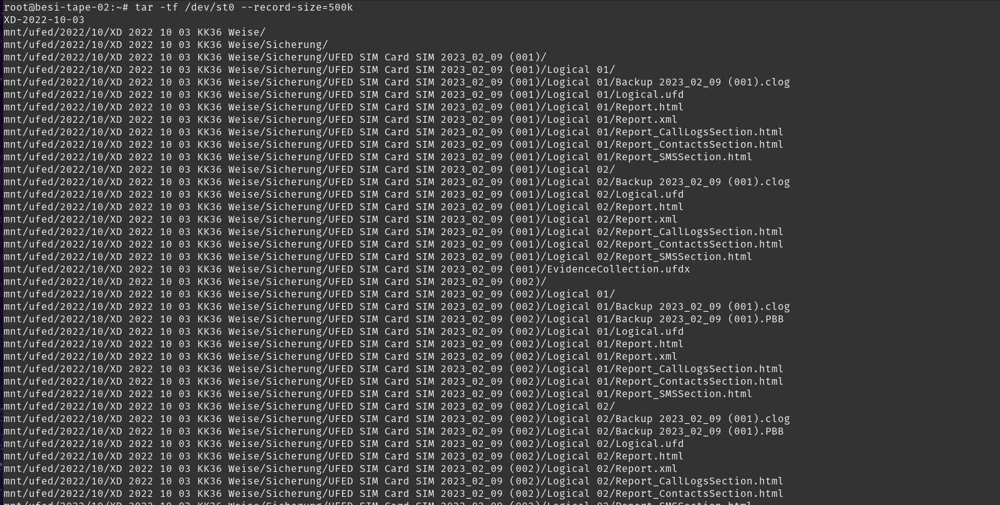
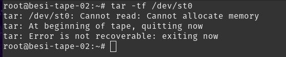

# lto_manager

LTO manager script for writing, reading and erasing magnetic tapes.

## Docker

### Build Image from Dockerfile

> **IMPORTANT:**  Internet access and root privileges required!

	$ cd /mnt/share/Benutzer/David/4n6-tools/lto_manager/
	$ docker build --network host -t lto_manager .
	

### Run script in container
	
	$ docker run --rm -it --name lto_manager --privileged -v /dev:/dev -v /mnt:/mnt lto_manager
	
### Install short script

	$ cp /mnt/share/Benutzer/David/4n6-tools/lto_manager/lto_manager /usr/local/bin/$1
	

## How to use
### Run lto_manager
From any location simply run

	$ lto_manager
In the following menu use up and down keys to switch between menu options:

Select option 1. Backup Directory.
Then for source put in the folder you want to backup. You can use any location, e.g. directly from network share:

Next enter a label for the tape without spaces! You can use any label, e.g. viva or XD number:

In the next step it lists all available tape drives, here only one LTO-6 drive. For selection enter 6 into the field as the target drive:

As the final step verify the information and type y for validation to start writing to the tape:

> **NOTICE:**  The memory warnings are just for information and can be ignored.

The script will auto unload the tape from the drive when finished writing so you can safely withdraw the tape.

### Verify tape content
You can list the content of any TAR like on a tape with the same methods.

	$ tar -tf /dev/st0 --record-size=500k
	

> **NOTICE:**  The record size is set by our lto_manager script to 500k and has to set to this value again every time reading the tar. Otherwise you get a allocation error as the following:

> 

### Unload tape manually
To unload simply type

	$ mt -f /dev/st0 offline
	
You could also use the following

	$ mt -f /dev/st0 rewoffl

The difference is that *rewoffl* first rewinds the tape to its beginning and the unloads the tape from the drive. However, since we use the device */dev/st0* the tape is automatically rewind to the start after every command. Hence, rewinding before unloading is not necessary.

